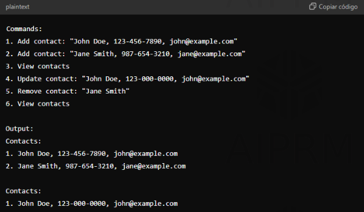
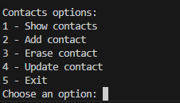
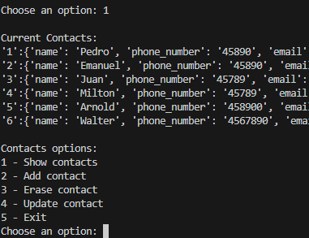
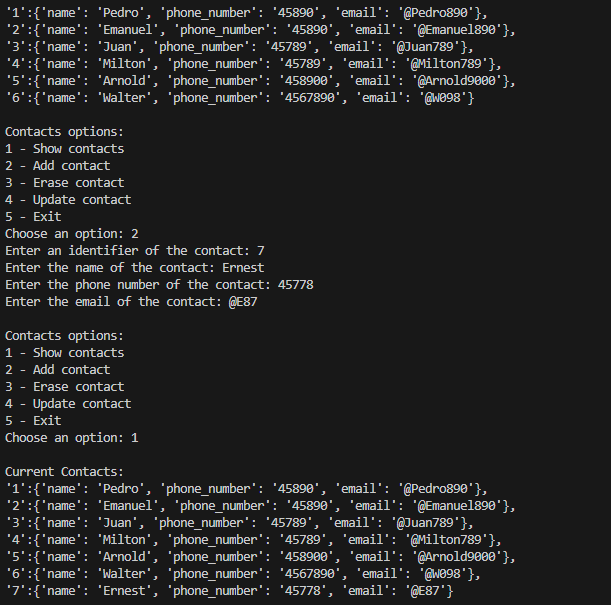
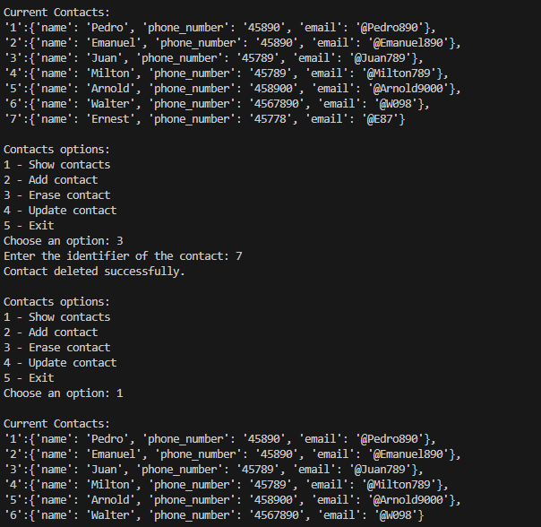
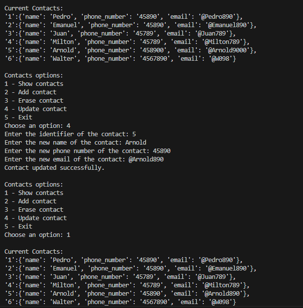

# Contact managemnt system

## **Description**
Develop a contact management system to add, remove, update, and view contact information.

## **Requirements**

- The program should support adding a new contact (name, phone number, email).

- It should allow updating and removing contacts.

- It should display all contacts.

## Example: 

## **Libraries and Tools**

No external libraries required.

## **Hints**

1- Use a dictionary to store contact information.

2- Implement CRUD (Create, Read, Update, Delete) operations.

## **Topics to Study**

- Dictionary operations

- Input validation

## **Methodological Steps**

- Define data structures: Use a dictionary to store contacts.

- Implement CRUD operations: Write functions to add, update, remove, and display contacts.

- User interaction: Use a loop to handle user commands.

- Persist data: Optionally, save contacts to a file and load them on startup.

## **Best Practices**
- Validate inputs: Ensure user enters valid contact details.

- Maintain clarity: Clear separation of different functionalities for easy maintenance.

- Persist data: Consider using a database for more robust storage in a real application.

## Project
Next I will show the running project:

Below I will show each function one by one:

Function 1:

Show all the contacts in the data base

Function 2:

Add a coctact to the data base

Function 3:

Delete a contact from the database

Function 4:

Overwrite the information of a contact

## Architecture

The project is divided into three folders: db (database), rsc (resources), and src (source code). The db folder contains a .txt file with a list of contacts. In the rsc folder, there are images used in the README. The src folder contains the lib directory, which includes a module for working with the database (dbOperations.py), and the main.py file, which is the executable file. It contains a function that uses all the functions from the dbOperations.py module to shape the program.

## References

- Installation
Clone the repository:

git clone https://github.com/kevin-pb/python-proyect-contact-management-system.git

- Run
python main.py